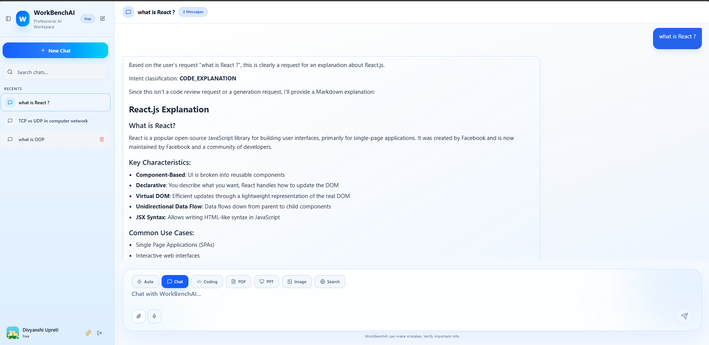
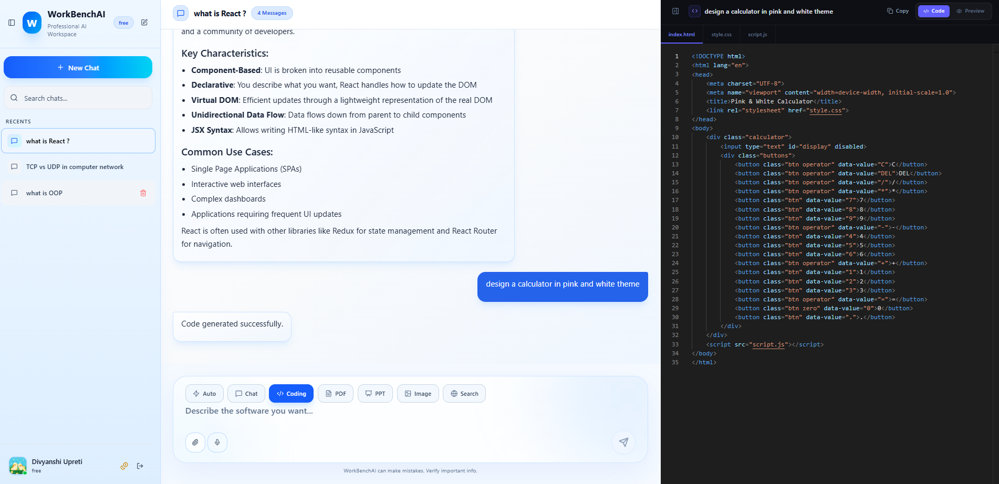
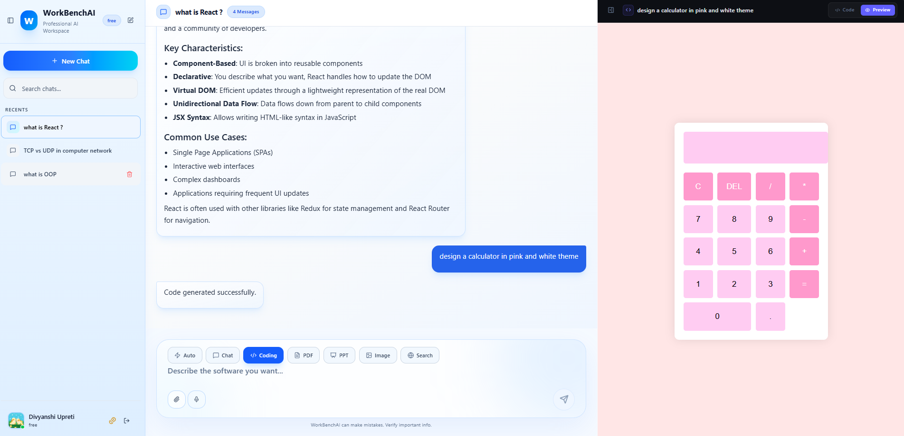
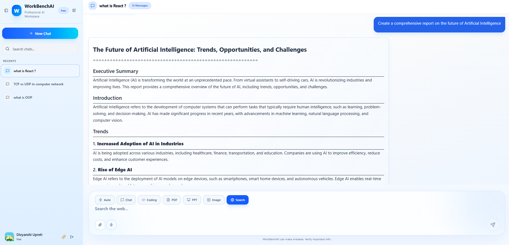
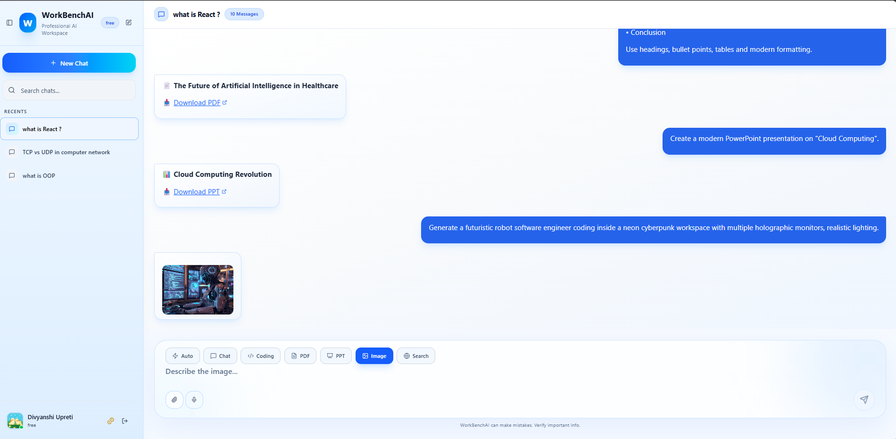
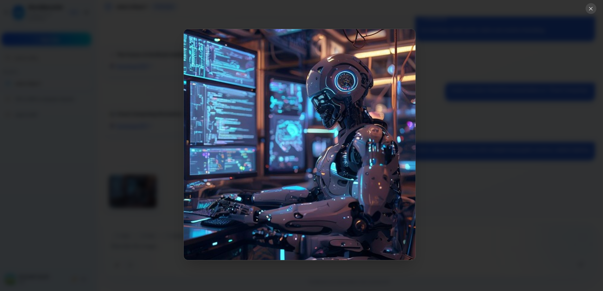
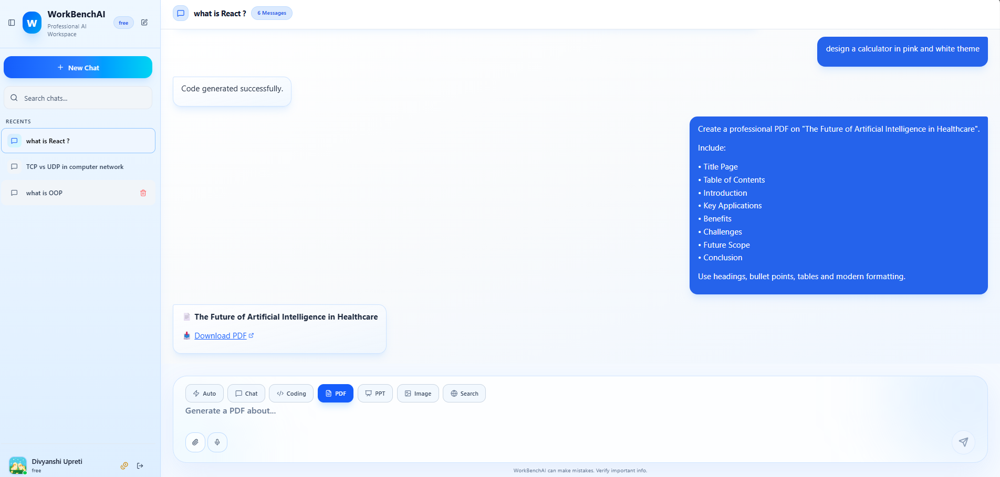
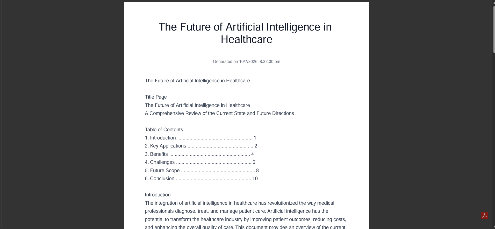
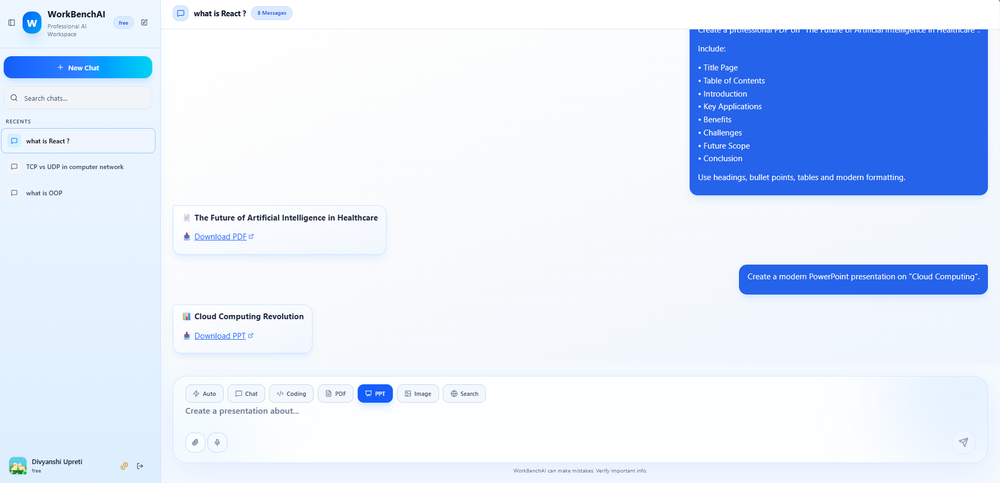
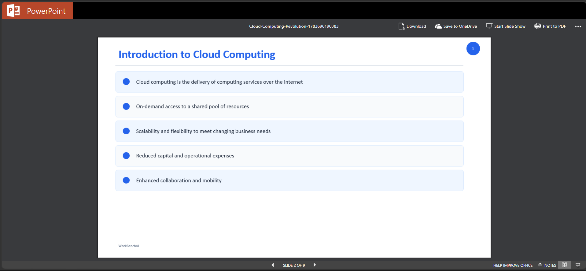

# 🚀 WorkBenchAI
> An all-in-one AI workspace for chatting, coding, web search, image generation, PDF creation, PowerPoint generation, and intelligent file assistance.


---
## 📖 Overview

WorkBenchAI is a modern AI productivity platform inspired by professional AI workspaces. It combines multiple AI capabilities into a single application, allowing users to generate code, search the web, create presentations, generate PDFs, create AI images, and interact with an intelligent conversational assistant.

The application provides a clean, premium interface with secure authentication, conversation history, artifact management, and multiple AI agents.

---

## ✨ Features

### 💬 AI Chat
- Intelligent conversational assistant
- Conversation history
- Markdown rendering
- Syntax highlighted code blocks
- Copy code functionality
- Image preview support

  

### 💻 Coding Assistant
- Generate code
- Explain code
- Debug code
- Multiple programming languages

  
  

### 🌍 AI Web Search
- Search the web using AI
- Summarized responses
- Rich formatted answers

### 🖼 AI Image Generation
- Generate images from prompts
- Image preview
- Download generated images


### 📄 PDF Generator
- Generate professional PDF documents
- Download generated PDFs



### 📊 PowerPoint Generator
- Generate presentation slides
- Automatic PPT creation
- Download presentations



### 📁 File Upload
- Upload PDFs
- Upload Images
- AI understands uploaded files

### 🎤 Voice Input
- Speech Recognition
- Voice to Prompt

### 👤 Authentication
- Firebase Google Login
- Secure Authentication
- Persistent Sessions
  
### 📜 Conversation Management
- Create chats
- Delete chats
- Conversation history
- Automatic title generation

---
# 🛠 Tech Stack

## Frontend

- React
- Redux Toolkit
- Tailwind CSS
- Framer Motion
- React Markdown
- React Syntax Highlighter
- Lucide React

## Backend

- Node.js
- Express.js
- MongoDB Atlas
- Mongoose
- Multer
- Cloudinary

## AI Services

- Google Gemini
- Image Generation API
- PPT Generation
- PDF Generation

## Authentication

- Firebase Authentication

---

# 📂 Project Structure

```
WorkBenchAI
│
├── frontend
│   ├── components
│   ├── pages
│   ├── redux
│   ├── features
│   └── utils
│
├── backend
│   ├── services
│   │   └── agent
│   ├── routes
│   ├── middleware
│   ├── models
│   └── controllers
│
└── README.md
```

---
# 👩‍💻 Author

**Divyanshi Upreti**

Computer Science Engineering Student

Graphic Era Hill University

GitHub:
https://github.com/divyanshiupreti11

LinkedIn:
https://www.linkedin.com/in/divyanshi-upreti-4a757b322/

---
